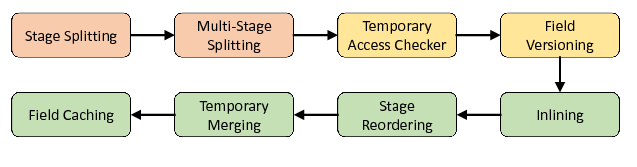

Dawn toolchain
##############

The toolchain of Dawn contains several modules and is organized in passes, allowing to customize the process by enabling, disabling or change the order of execution of the individual passes. The default order of execution, depicted in :numref:`Figure %s <toolchain_process>`, starts by translating the SIR into an *internal* SIR (:ref:`ISIR <ISIR>`) which enriches the SIR with various information, like the computation of the access patterns, required by the following passes. As the initial construction of the ISIR generates a parallel program that is most likely incorrect under the given parallel model, we invoke several passes (`Parallel Model Builder`_) to build a valid parallel program. The `Safety Checker`_ passes will run various static analysis routines and the `Optimizer`_ will perform several optimizations such as reordering and fusing groups of statements, setting software managed caches or reducing shared-memory pressure. Finally, the code generation will translate the ISIR into the main DSL of GridTools or directly to C++.

.. _toolchain_process:

  Default order of execution of the passes grouped in `Parallel Model Builder`_ (orange), `Safety Checker`_ (yellow) and `Optimizer`_ (green).

.. _Parallel Model Builder:

Parallel Model Builder
======================

The parallel model builder passes transform the initial Stage and Multi-Stage arrangement into a valid parallel program under the :ref:`GridTools parallel model <GridTools Parallel Model>`. 

.. _Safety Checker:

Safety Checker
==============

TODO

.. _Optimizer:

Optimizer
=========

TODO