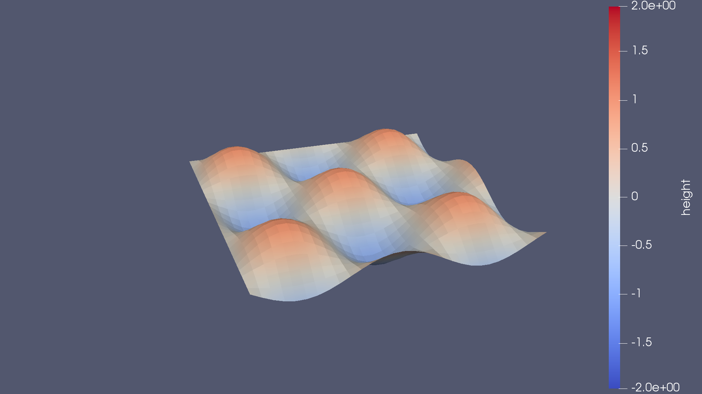
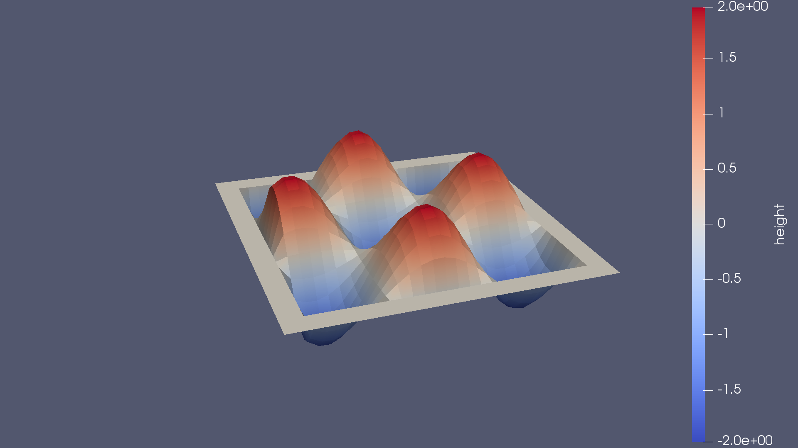

# Getting Started using GTClang & dawn

In this tutorial the basic usage of **GTClang** will be demonstrated using a simple example. To follow this tutorial, please make sure that you compiled **GTClang** with the `GTCLANG_ENABLE_GRIDTOOLS=ON` flag. The readme in the gtclang subdirectory has instructions on how to do that. We will compile and execute the same stencil three times: once starting from a stencil written with the **GTClang** DSL, once starting by using Python to write SIR, and once handing over SIR to dawn using C++.

## Writing a Stencil in the GTClang SIR and Compiling the Stencil

For the purpose of this exercise, we will write a simple Finite Difference Stencil to find the Laplacian of a function. In **GTClang**, this can be achieved using very few lines of code as demonstrated in `laplacian_stencil.cpp`:

```
globals {
  double dx;  //grid spacing
};

stencil laplacian_stencil {
  storage_ij out_field;
  storage_ij in_field;
  Do() {
    vertical_region(k_start, k_end) {
	    out_field[i,j] = (-4*in_field + in_field[i+1] + in_field[i-1] + in_field[j-1] + in_field[j+1])/(dx*dx);
    }
  }
};
```

This code defines two fields which will serve as the arguments to the stencil. The variable `dx` is the grid spacing and is read-only (during the stencil run), which is modelled as a global in **GTClang**. Observe how close the actual Laplacian stencil is to the numerical formula (c.f. for example [wikipedia](https://en.wikipedia.org/wiki/Finite_difference#Finite_difference_in_several_variables)), which close to no boiler plate. Save the stencil as `laplacian_stencil.cpp`.

For the purpose of this tutorial we are going to use the `C++-naive` backend. To compile the stencil use:
```
./gtclang -backend=c++-naive laplacian_stencil.cpp -o laplacian_stencil_cxx_naive.cpp
```

## Writing and Compiling the Driver Code

**GTClang** output a c++11-compliant source file. This code reads in a field `in_field`, applies the stencil, and writes the result into `out_field`. To use this, we need a driver. For the purpose of this exercise we are going initialize `in_field` to a wave function `in(x,y) = sin(x)*sin(y)`, since the Laplacian of this is the same wave again, but with inverted phase and twice the amplitude, and thus easy to check. The driver code is located in `laplacian_driver.cpp` and should be straightforward. The actual stencil launch is just one line:

```
dawn_generated::cxxnaive::laplacian_stencil laplacian_naive(dom, out, in);
laplacian_naive.set_dx(dx);
laplacian_naive.run(out, in);   //launch stencil
```

the run method could now be called in a time loop, for example to simulate diffusion. To facilitate the compilation, a `CMakeLists.txt` file has been provided. To compile the code:

```
mkdir build && cd build && cmake .. && make
```

This will place an executable called `laplacian_driver` in the tutorial directory. When run, two `vtk` files will be written. Those can be viewed using (ParaView)[https://www.paraview.org/]. `in.vtk` shows the initial conditions. If `out.vtk` is loaded on top, the inversion of phase and twicefold increase in amplitude can clearly be seen, as well as the halos around the domain, which would overlap with a "neighboring" MPI rank in practical implementations.

  

## Use Python to generate SIR 

Another option to use **dawn** without having to rely on the **GTClang** DSL is to use the Python interface provided. As a preliminary step, a config file that was generated during the **dawn** install step needs to be copied and the proper `PYTHONPATH` needs to be set. Assuming you built dawn using the bundle this is:

```
cd <path/to/dawn>/dawn/examples/
cp ../bundle/install/examples/python/config.py .
export PYTHONPATH+=:../../bundle/install/python/
```

The python file provided can now be run:

```
python3 laplacian_stencil.py
```

The python file will do three things:

1) Print the SIR generated within to `stdout`
2) The python exploits the c interface to **dawn** (which is easily callable from python) to compile the SIR to C++ code, using the C++ naive backend again (`laplacian_stencil_from_python.cpp`). 
3) Write the the SIR to disk in binary form (`laplacian_stencil_from_python.sir`)

You can check that the generated code is in fact equal to the code generated using the **GTClang** DSL from the example above by changing line `6` from

```
#include "laplacian_stencil_cxx_naive.cpp"
```

to 

```
#include "laplacian_stencil_from_python.cpp"
```

then re-compile and re-run the driver

```
make && ./laplacian-driver
```

The python file should be quite easy to follow. The the bulk of the AST of the stencil is generated in function `create_vertical_region_stmt`. 

## Generate code from SIR using dawn from C++

As a final exercise, the C interface to dawn is again used to compile the same example. This time, however, the interface is called from a C++ file. This example will use the SIR written to disk by the preceding example, so please make sure that you followed along beforehand. Switch to the cpp example and build the `dawn_standalone` binary:

```
cd cpp
mkdir build
cd build
cmake .. && make
./dawn_standalone
```

consider opening the file `introDawnStandalone.cpp` to see whats happening: the binary SIR written by the last example is deserialized and the C interface to dawn is called to generate C++-naive code once again. Again, you can make sure that the code is still equivalent to our reference by modfying the driver code, simply replace `#include "laplacian_stencil_cxx_naive.cpp` by `cpp/laplacian_stencil_from_standalone.cpp`.
